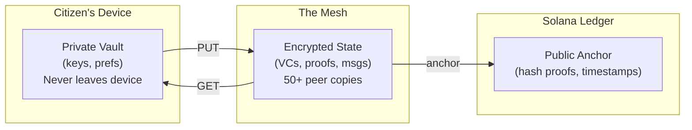

# attestto-mesh

[](https://www.npmjs.com/package/@attestto/mesh)

> Public digital infrastructure for sovereign identity — a peer-to-peer data layer that keeps citizens' identity state available even when government servers go offline.

`@attestto/mesh` is an open-source, decentralized state-sync layer for identity data. Every participating device contributes storage to form a resilient mesh that protects verifiable credentials, cryptographic proofs, and secure messages without depending on any centralized server. This is not a blockchain. This is not a file system. This is **distributed identity infrastructure** for nations. Learn more at [attestto.org](https://attestto.org).

## Architecture



**Three-layer resolution:**
1. **Local cache** — 0ms (data on your device)
2. **Mesh peers** — <100ms (DHT lookup, nearby nodes serve encrypted blobs)
3. **Solana anchor** — 200-500ms (immutable proof-of-existence)

If any layer fails, the others keep working. Graceful degradation by design.

## Quick start

### Prerequisites

- Node.js 18+
- pnpm (or npm)

### Install

```bash
pnpm install @attestto/mesh
```

### Try it

```typescript
import { MeshNode, MeshStore, MeshProtocol } from '@attestto/mesh'

// Initialize storage
const store = new MeshStore('/path/to/mesh/data')

// Start a P2P node
const node = new MeshNode({
  dataDir: '/path/to/mesh/data',
  bootstrapPeers: ['/ip4/203.0.113.1/tcp/4001/p2p/Qm...'],
  listenPort: 4001,
})
await node.start()

// Wire up the protocol layer
const protocol = new MeshProtocol(node, store)

// Publish encrypted data to the mesh
const contentHash = await protocol.put({
  didOwner: 'did:sns:maria.sol',
  path: 'credentials/drivers-license',
  version: 1,
  ttlSeconds: 0,
  signature: '...',
  solanaAnchor: null,
}, encryptedBlob)

// Retrieve from any peer
const result = await protocol.get('did:sns:maria.sol', 'credentials/drivers-license')
```

Run the demo to see it work end-to-end:

```bash
pnpm demo              # Two nodes in one process, 15 seconds
pnpm demo:alpha        # Multi-machine setup
pnpm demo:beta --peer /ip4/192.168.1.X/tcp/4001/p2p/...
docker compose up      # Zero dependencies, Docker only
```

## Key concepts

### API: MeshNode, MeshStore, MeshProtocol

| Component | Purpose | Technology |
|-----------|---------|-----------|
| **MeshNode** | P2P networking, peer discovery, gossip propagation | libp2p, Kademlia DHT, GossipSub |
| **MeshStore** | Local encrypted blob storage with SQLite index | SQLite + `.enc` files |
| **MeshProtocol** | PUT/GET/UPDATE/TOMBSTONE operations | Content-addressed, signature-verified |
| **Conflict Resolution** | Deterministic version arbitration | Solana anchor > version > timestamp > hash |
| **Garbage Collection** | Automatic cleanup with safety rails | TTL expiry, version pruning, LRU (6-holder minimum) |

### Protocol operations

```typescript
// Publish
const hash = await protocol.put({
  didOwner: 'did:sns:citizen.sol',
  path: 'credentials/driving-license',
  version: 1,
  ttlSeconds: 0,           // 0 = permanent
  signature: '...',        // Ed25519 signature
  solanaAnchor: null,
}, encryptedBlob)

// Retrieve
const result = await protocol.get(
  'did:sns:citizen.sol',
  'credentials/driving-license'
)

// Update
await protocol.update(...)

// Revoke
await protocol.tombstone(...)
```

### The Blind Courier principle

Every node stores encrypted data it mathematically cannot read. Privacy is not a policy — it is a cryptographic guarantee. No single node, no combination of nodes, can access plaintext identity data without the citizen's private key.

### What gets stored

| Data | Size | Storage | Why |
|------|------|---------|-----|
| DID Documents | 1–2 KB | Mesh | Public identity, resolvable by anyone |
| Verifiable Credentials | 1–5 KB | Mesh | Backup, recovery, third-party presentation |
| Secure Messages (DIDComm) | <2 KB | Mesh | Temporary, deleted after recipient acks |
| Audit Receipts | <500 B | Mesh | Permanent Solana-anchored trail |
| Private Keys | <1 KB | Device only | Never touches the network |
| User Preferences | 200 B | Device only | Stays in local wallet |

**Total per citizen: ~120 KB.** A national mesh of 5 million people fits in ~600 GB across thousands of nodes.

### Multi-country mesh isolation

The `meshId` configuration isolates meshes by country. Same protocol, different networks — no cross-country data leakage.

```typescript
// Costa Rica
new MeshNode({ meshId: 'attestto-cr', dataDir: '/data/mesh' })

// Panama
new MeshNode({ meshId: 'attestto-pa', dataDir: '/data/mesh' })
```

Each mesh ID creates a separate gossip topic. Nodes only peer with others on the same mesh.

## Ecosystem

| Repo | Role | Relationship |
|------|------|--------------|
| [`attestto-app`](../attestto-app) | Mobile PWA wallet | Connects to mesh for credential sync and recovery |
| [`attestto-desktop`](../attestto-desktop) | Electron station | Heavy signing, mesh node operations (250 MB contribution) |
| [`vc-sdk`](../vc-sdk) | Credential library | Issues and verifies VCs stored in the mesh |
| [`did-sns-spec`](https://github.com/Attestto-com/did-sns-spec) | DID standard | `did:sns` method on Solana |
| [`cr-vc-schemas`](https://github.com/Attestto-com/cr-vc-schemas) | Credential schemas | Costa Rica credential type definitions |

## Build with an LLM

This repo ships a [`llms.txt`](./llms.txt) context file — a machine-readable summary of the API, data structures, and integration patterns designed to be read by AI coding assistants.

### Recommended setup

Use the [`attestto-dev-mcp`](../attestto-dev-mcp) server to give your LLM active access to the ecosystem:

```bash
cd ../attestto-dev-mcp
npm install && npm run build
```

Then add it to your Claude / Cursor / Windsurf config and ask:

> *"Explore the Attestto ecosystem and help me extend [this component]"*

### Which model?

We recommend **[Claude](https://claude.ai) Pro** (5× usage vs free) or higher. Long context, strong TypeScript reasoning, and libp2p familiarity handle this codebase well. The MCP server works with any LLM that supports tool use.

> **Quick start:** Ask your LLM to read `llms.txt` in this repo, then describe what you want to build. It will find the right archetype, generate boilerplate, and walk you through the first run.

## Contributing

See [`TECHNICAL.md`](./TECHNICAL.md) for:
- API reference
- Project structure
- Testing and builds
- Architecture decisions

Contributions welcome. All code Apache 2.0.

## License

[Apache 2.0](./LICENSE) — Use it, fork it, deploy it. No vendor lock-in.

Built by [Attestto](https://attestto.com) as Public Digital Infrastructure for Costa Rica and beyond.
