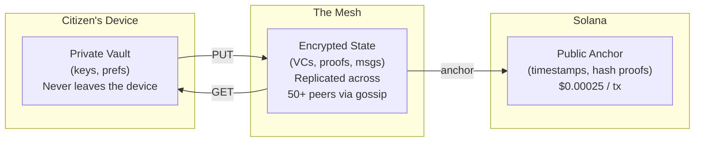

**[English](./README.md)** | [Espanol](./docs/translations/README.es.md)

---

# Attestto Mesh

**Public Digital Infrastructure for Sovereign Identity**

Attestto Mesh is an open-source, peer-to-peer data layer that enables nations to run resilient identity infrastructure without centralized servers. Every participating device contributes a small amount of storage to form a distributed mesh that keeps citizens' identity state available — even when government servers go offline.

This is not a blockchain. This is not a file system. This is a **distributed state-sync layer** for identity data: verifiable credentials, cryptographic proofs, audit receipts, and secure messages — all under 120 KB per citizen.

---

## Why This Exists

Traditional digital identity depends on servers. If those servers go down — due to a hurricane, a cyberattack, or a policy change — millions of people lose access to their identity.

Attestto Mesh removes that single point of failure. Identity data is encrypted, fragmented across thousands of peers, and cryptographically anchored to a public ledger. No single entity — not Attestto, not a government, not a cloud provider — can shut it down.

### The Problem It Solves

| Scenario | Traditional System | Attestto Mesh |
|:---------|:-------------------|:--------------|
| National ISP outage | Identity verification fails | Peers verify locally via mesh |
| Government servers hacked | Identity data exposed or locked | Encrypted shards — nodes can't read what they store |
| Cloud vendor lock-in | Migration costs millions | Open protocol — fork it, run it, own it |
| Rural area without internet | No access to identity services | Local mesh operates between nearby peers |

### Design Principles

- **Blind Courier:** Every node stores encrypted data it cannot read. Privacy is not a policy — it is a mathematical guarantee.
- **Stewardship, Not Control:** Attestto builds the infrastructure and hands it over. Institutions govern their own credential schemas. Citizens own their own keys.
- **National Resilience:** The mesh survives without any single organization, server, or internet connection.

---

## How It Works



**Three layers of resolution:**
1. **Local cache** — 0ms (data already on your device)
2. **Mesh peers** — <100ms (nearby nodes serve encrypted blobs via DHT)
3. **Solana anchor** — 200-500ms (cryptographic proof of existence and ordering)

If any layer goes down, the others keep working. This is **graceful degradation by design**.

---

## Architecture at a Glance

| Component | Purpose | Technology |
|:----------|:--------|:-----------|
| **Mesh Node** | P2P networking, peer discovery, gossip | libp2p, Kademlia DHT, GossipSub |
| **Mesh Store** | Local encrypted blob storage with index | SQLite + flat `.enc` files |
| **Protocol** | PUT/GET/UPDATE operations across the mesh | Content-addressed, signature-verified |
| **Conflict Resolution** | Deterministic version arbitration | Solana anchor > version > timestamp > hash |
| **Garbage Collection** | Automatic cleanup with safety rails | TTL expiry, version pruning, LRU with 6-holder minimum |
| **Solana Anchor** | Immutable proof-of-existence timestamps | Memo transactions (~$0.00025 each) |

### What Gets Stored (and What Doesn't)

| Data Type | Size | Where | Why |
|:----------|:-----|:------|:----|
| DID Documents | 1-2 KB | Mesh | Public identity — needs to be resolvable by anyone |
| Verifiable Credentials | 1-5 KB | Mesh | Backup + recovery + presentation to third parties |
| Secure Messages (DIDComm) | <2 KB | Mesh | Temporary — deleted after recipient acknowledges |
| Audit Receipts | <500 B | Mesh | Permanent trail of Solana-anchored transactions |
| Private Keys | <1 KB | **Device only** | Never touches the network |
| User Preferences | 200 B | **Device only** | No value to third parties — stays in local wallet |
| Files (PDFs, videos) | Large | **Not stored** | This is not a file system |

**Total mesh footprint per citizen: ~120 KB.** A national mesh for 5 million people fits in ~600 GB distributed across thousands of nodes.

---

## Positioning

Attestto Mesh belongs to the emerging category of **Public Digital Infrastructure (PDI)** — open protocols that governments and institutions can adopt without vendor lock-in.

| | Traditional Gov IT | Web5 (TBD/Block) | Attestto Mesh |
|:---|:---|:---|:---|
| **Data availability** | Server uptime | User's phone battery | 50x peer redundancy |
| **Privacy model** | Trust the database admin | Trust your own node | **Blind Courier** — nodes can't read data |
| **Ledger** | None (or proprietary audit) | Bitcoin (slow, expensive) | Solana (fast, $0.00025/tx) |
| **Vendor dependency** | High (Microsoft, Oracle) | Medium (cloud DWN hosting) | **Zero** — Apache 2.0, forkable |
| **Offline capability** | None | Only if phone is on | Local mesh between nearby peers |

### Standards Compliance

- **W3C Decentralized Identifiers (DIDs)** — `did:sns` method on Solana Name Service
- **W3C Verifiable Credentials** — JSON-LD and SD-JWT credential formats
- **ISO 18013-5 (mDL)** — Mobile driving license interoperability
- **DIDComm v2** — Encrypted peer-to-peer messaging
- **PAdES (LT/LTA)** — Long-term PDF signature verification

---

## For Developers

> **Technical documentation, API reference, and contribution guide live in [`TECHNICAL.md`](./TECHNICAL.md).**

### Quick Start

```bash
pnpm install @attestto/mesh
```

```typescript
import { MeshNode, MeshStore, MeshProtocol } from '@attestto/mesh'

// Initialize storage (250 MB default)
const store = new MeshStore('/path/to/mesh/data')

// Start a P2P node
const node = new MeshNode({
  dataDir: '/path/to/mesh/data',
  bootstrapPeers: ['/ip4/203.0.113.1/tcp/4001/p2p/Qm...'],
  listenPort: 4001,
})
await node.start()

// Wire up the protocol layer
const protocol = new MeshProtocol(node, store)

// Publish encrypted data to the mesh
const contentHash = await protocol.put({
  didOwner: 'did:sns:maria.sol',
  path: 'credentials/drivers-license',
  version: 1,
  ttlSeconds: 0,  // permanent
  signature: '...',
  solanaAnchor: null,
}, encryptedBlob)

// Retrieve from any peer
const result = await protocol.get('did:sns:maria.sol', 'credentials/drivers-license')
```

**Verifier example** — a bank verifying a customer's credential:

```typescript
// Bank wants to verify Maria's driver's license
const credential = await protocol.get('did:sns:maria.sol', 'credentials/drivers-license')

if (credential) {
  // Verify the blob hasn't been tampered with
  const hashValid = hashBlob(credential.blob) === credential.metadata.contentHash

  // Verify the credential was signed by Maria's DID
  const sigValid = await verifySignature(
    credential.blob,
    credential.metadata.signature,
    mariaPublicKey
  )

  // Check if anchored on Solana (strongest guarantee)
  const anchored = credential.metadata.solanaAnchor !== null

  console.log({ hashValid, sigValid, anchored })
  // → { hashValid: true, sigValid: true, anchored: true }
}
```

No API keys. No account creation. No server to call. The bank resolves Maria's credential directly from the mesh, verifies the math, and makes a decision — in under 100ms.

### Project Structure

```
src/
├── types.ts       — Core interfaces (MeshItem, MeshKey, MeshEvent, GossipMessage)
├── node.ts        — libp2p node lifecycle (TCP, Noise, Yamux, Kademlia, GossipSub)
├── store.ts       — SQLite index + encrypted blob storage with CRUD + metrics
├── protocol.ts    — PUT/GET orchestration, gossip propagation, conflict handling
├── conflict.ts    — Deterministic version resolution (anchor > version > timestamp > hash)
├── gc.ts          — Three-layer garbage collection (TTL, version pruning, LRU + safety rail)
├── crypto.ts      — SHA-256 hashing, Ed25519 sign/verify
├── anchor.ts      — Solana memo transaction anchoring
└── index.ts       — Public API exports

tests/
├── store.test.ts     — 18 tests: CRUD, versioning, tombstone, metrics, limits
├── conflict.test.ts  — 6 tests: anchor priority, version, timestamp, deterministic tiebreak
└── crypto.test.ts    — 6 tests: SHA-256, Ed25519 sign/verify, tamper detection
```

### Running Tests

```bash
pnpm test          # 30 tests, ~700ms
pnpm type-check    # TypeScript strict mode
pnpm build         # Dual ESM/CJS output via tsup
```

### Running the Demo

The Proof of Logic demo validates all mesh primitives end-to-end: peer discovery, data sync, conflict resolution, garbage collection, and DID revocation.

**Quick demo — see it work in 15 seconds:**

```bash
pnpm demo
```

Spins up two mesh nodes in a single process. Both discover each other, sync a credential, resolve a version conflict via Solana anchor, prune 20 versions down to 2, expire a TTL message, and propagate a DID tombstone. No configuration needed.

**Two machines on the same network — prove it works across real hardware:**

```bash
# Your machine
pnpm demo:alpha

# Colleague's machine (use the multiaddr printed by alpha)
pnpm demo:beta --peer /ip4/192.168.1.X/tcp/4001/p2p/12D3Koo...
```

Alpha starts a node and prints its address. Beta connects and the two exchange data over TCP. Validates that the mesh works between independent machines, not just in-process.

**Docker — zero local dependencies, anyone can run it:**

```bash
# Quick demo (no Node.js required, just Docker)
docker build -t attestto-mesh . && docker run attestto-mesh

# Two containers talking to each other
docker compose up
```

For reviewers, auditors, or grant evaluators who want to verify the protocol without installing Node.js, pnpm, or any toolchain. Build the image once, run it anywhere.

---

## Multi-Country Mesh Isolation

The `meshId` configuration isolates meshes by country. Same protocol, different networks — data from one country never leaks into another.

```typescript
// Costa Rica
new MeshNode({ meshId: 'attestto-cr', dataDir: '/data/mesh' })

// Panama
new MeshNode({ meshId: 'attestto-pa', dataDir: '/data/mesh' })
```

Each mesh ID creates a separate gossip topic (`/attestto/mesh/{meshId}/1.0.0`). Nodes only discover and sync with peers on the same mesh. A single codebase serves any country that adopts the infrastructure.

---

## Related Repositories

| Repository | Description |
|:-----------|:------------|
| [`did-sns-spec`](https://github.com/Attestto-com/did-sns-spec) | DID method specification for Solana Name Service |
| [`cr-vc-schemas`](https://github.com/Attestto-com/cr-vc-schemas) | Verifiable Credential schemas for Costa Rica |
| [`attestto-verify`](https://github.com/Attestto-com/verify) | Open-source document verification web components |
| [`id-wallet-adapter`](https://github.com/Attestto-com/id-wallet-adapter) | Wallet discovery and credential exchange protocol |

---

## License

[Apache 2.0](./LICENSE) — Use it, fork it, deploy it. No vendor lock-in. No permission needed.

Built by [Attestto](https://attestto.com) as Public Digital Infrastructure for Costa Rica and beyond.
