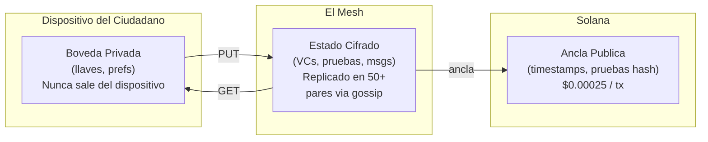

[English](../../README.md) | **[Espanol](./README.es.md)**

---

# Attestto Mesh

**Infraestructura Digital Publica para Identidad Soberana**

Attestto Mesh es una capa de datos peer-to-peer de codigo abierto que permite a las naciones operar infraestructura de identidad resiliente sin servidores centralizados. Cada dispositivo participante contribuye una pequena cantidad de almacenamiento para formar un mesh distribuido que mantiene el estado de identidad de los ciudadanos disponible — incluso cuando los servidores del gobierno estan fuera de linea.

Esto no es una blockchain. Esto no es un sistema de archivos. Es una **capa de sincronizacion de estado distribuida** para datos de identidad: credenciales verificables, pruebas criptograficas, recibos de auditoria y mensajes seguros — todo en menos de 120 KB por ciudadano.

---

## Por Que Existe

La identidad digital tradicional depende de servidores. Si esos servidores caen — por un huracan, un ciberataque o un cambio de politica — millones de personas pierden acceso a su identidad.

Attestto Mesh elimina ese punto unico de falla. Los datos de identidad se cifran, se distribuyen entre miles de pares, y se anclan criptograficamente a un libro publico. Ninguna entidad — ni Attestto, ni un gobierno, ni un proveedor de nube — puede apagarlo.

### El Problema que Resuelve

| Escenario | Sistema Tradicional | Attestto Mesh |
|:----------|:--------------------|:--------------|
| Caida del ISP nacional | La verificacion de identidad falla | Los pares verifican localmente via mesh |
| Servidores del gobierno hackeados | Datos de identidad expuestos o bloqueados | Fragmentos cifrados — los nodos no pueden leer lo que almacenan |
| Dependencia de proveedor de nube | Migrar cuesta millones | Protocolo abierto — bifurcalo, ejecutalo, es tuyo |
| Zona rural sin internet | Sin acceso a servicios de identidad | El mesh local opera entre pares cercanos |

### Principios de Diseno

- **Cartero Ciego:** Cada nodo almacena datos cifrados que no puede leer. La privacidad no es una politica — es una garantia matematica.
- **Custodia, No Control:** Attestto construye la infraestructura y la entrega. Las instituciones gobiernan sus propios esquemas de credenciales. Los ciudadanos son duenos de sus propias llaves.
- **Resiliencia Nacional:** El mesh sobrevive sin ninguna organizacion, servidor o conexion a internet individual.

---

## Como Funciona



**Tres capas de resolucion:**
1. **Cache local** — 0ms (datos ya en tu dispositivo)
2. **Pares del mesh** — <100ms (nodos cercanos sirven blobs cifrados via DHT)
3. **Ancla Solana** — 200-500ms (prueba criptografica de existencia y orden)

Si cualquier capa cae, las otras siguen funcionando. Esto es **degradacion elegante por diseno**.

---

## Arquitectura en un Vistazo

| Componente | Proposito | Tecnologia |
|:-----------|:----------|:-----------|
| **Nodo Mesh** | Red P2P, descubrimiento de pares, gossip | libp2p, Kademlia DHT, GossipSub |
| **Almacen Mesh** | Almacenamiento local de blobs cifrados con indice | SQLite + archivos `.enc` |
| **Protocolo** | Operaciones PUT/GET/UPDATE a traves del mesh | Direccionado por contenido, verificado por firma |
| **Resolucion de Conflictos** | Arbitraje deterministico de versiones | Ancla Solana > version > timestamp > hash |
| **Recoleccion de Basura** | Limpieza automatica con rieles de seguridad | Expiracion TTL, poda de versiones, LRU con minimo de 6 holders |
| **Ancla Solana** | Timestamps inmutables de prueba de existencia | Transacciones memo (~$0.00025 c/u) |

### Que Se Almacena (y Que No)

| Tipo de Dato | Tamano | Donde | Por Que |
|:-------------|:-------|:------|:--------|
| Documentos DID | 1-2 KB | Mesh | Identidad publica — necesita ser resolvible por cualquiera |
| Credenciales Verificables | 1-5 KB | Mesh | Respaldo + recuperacion + presentacion a terceros |
| Mensajes Seguros (DIDComm) | <2 KB | Mesh | Temporal — se eliminan cuando el destinatario confirma |
| Recibos de Auditoria | <500 B | Mesh | Trail permanente de transacciones ancladas en Solana |
| Llaves Privadas | <1 KB | **Solo dispositivo** | Nunca tocan la red |
| Preferencias del Usuario | 200 B | **Solo dispositivo** | Sin valor para terceros — se quedan en el wallet local |
| Archivos (PDFs, videos) | Grandes | **No se almacenan** | Esto no es un sistema de archivos |

**Huella total del mesh por ciudadano: ~120 KB.** Un mesh nacional para 5 millones de personas cabe en ~600 GB distribuidos entre miles de nodos.

---

## Posicionamiento

Attestto Mesh pertenece a la categoria emergente de **Infraestructura Digital Publica (PDI)** — protocolos abiertos que gobiernos e instituciones pueden adoptar sin dependencia de proveedor.

| | TI Gubernamental Tradicional | Web5 (TBD/Block) | Attestto Mesh |
|:---|:---|:---|:---|
| **Disponibilidad de datos** | Uptime del servidor | Bateria del telefono del usuario | Redundancia de 50x entre pares |
| **Modelo de privacidad** | Confiar en el DBA | Confiar en tu propio nodo | **Cartero Ciego** — los nodos no pueden leer los datos |
| **Ledger** | Ninguno (o auditoria propietaria) | Bitcoin (lento, caro) | Solana (rapido, $0.00025/tx) |
| **Dependencia de vendor** | Alta (Microsoft, Oracle) | Media (hosting DWN en nube) | **Cero** — Apache 2.0, bifurcable |
| **Capacidad offline** | Ninguna | Solo si el telefono esta encendido | Mesh local entre pares cercanos |

### Cumplimiento de Estandares

- **W3C Decentralized Identifiers (DIDs)** — metodo `did:sns` sobre Solana Name Service
- **W3C Verifiable Credentials** — formatos JSON-LD y SD-JWT
- **ISO 18013-5 (mDL)** — interoperabilidad de licencia de conducir movil
- **DIDComm v2** — mensajeria cifrada peer-to-peer
- **PAdES (LT/LTA)** — verificacion de firmas digitales PDF a largo plazo

---

## Para Desarrolladores

> **Documentacion tecnica, referencia de API y guia de contribucion en [`TECHNICAL.md`](../../TECHNICAL.md).**

### Inicio Rapido

```bash
pnpm install @attestto/mesh
```

```typescript
import { MeshNode, MeshStore, MeshProtocol } from '@attestto/mesh'

// Inicializar almacenamiento (250 MB por defecto)
const store = new MeshStore('/ruta/a/datos/mesh')

// Arrancar un nodo P2P
const node = new MeshNode({
  dataDir: '/ruta/a/datos/mesh',
  bootstrapPeers: ['/ip4/203.0.113.1/tcp/4001/p2p/Qm...'],
  listenPort: 4001,
})
await node.start()

// Conectar la capa de protocolo
const protocol = new MeshProtocol(node, store)

// Publicar datos cifrados al mesh
const contentHash = await protocol.put({
  didOwner: 'did:sns:maria.sol',
  path: 'credentials/licencia-conducir',
  version: 1,
  ttlSeconds: 0,  // permanente
  signature: '...',
  solanaAnchor: null,
}, blobCifrado)

// Recuperar desde cualquier par
const result = await protocol.get('did:sns:maria.sol', 'credentials/licencia-conducir')
```

**Ejemplo de verificador** — un banco verificando la credencial de un cliente:

```typescript
// El banco quiere verificar la licencia de conducir de Maria
const credential = await protocol.get('did:sns:maria.sol', 'credentials/licencia-conducir')

if (credential) {
  // Verificar que el blob no fue manipulado
  const hashValido = hashBlob(credential.blob) === credential.metadata.contentHash

  // Verificar que la credencial fue firmada por el DID de Maria
  const firmaValida = await verifySignature(
    credential.blob,
    credential.metadata.signature,
    llavePublicaMaria
  )

  // Verificar si esta anclado en Solana (garantia mas fuerte)
  const anclado = credential.metadata.solanaAnchor !== null

  console.log({ hashValido, firmaValida, anclado })
  // → { hashValido: true, firmaValida: true, anclado: true }
}
```

Sin API keys. Sin crear cuenta. Sin servidor que llamar. El banco resuelve la credencial de Maria directamente desde el mesh, verifica la matematica, y toma una decision — en menos de 100ms.

### Estructura del Proyecto

```
src/
├── types.ts       — Interfaces core (MeshItem, MeshKey, MeshEvent, GossipMessage)
├── node.ts        — Ciclo de vida del nodo libp2p (TCP, Noise, Yamux, Kademlia, GossipSub)
├── store.ts       — Indice SQLite + almacenamiento de blobs cifrados con CRUD + metricas
├── protocol.ts    — Orquestacion PUT/GET, propagacion gossip, manejo de conflictos
├── conflict.ts    — Resolucion deterministica de versiones (ancla > version > timestamp > hash)
├── gc.ts          — Recoleccion de basura en tres capas (TTL, poda de versiones, LRU + riel de seguridad)
├── crypto.ts      — Hashing SHA-256, firma/verificacion Ed25519
├── anchor.ts      — Anclaje a Solana via transacciones memo
└── index.ts       — Exportaciones de API publica

tests/
├── store.test.ts     — 18 tests: CRUD, versionamiento, tombstone, metricas, limites
├── conflict.test.ts  — 6 tests: prioridad de ancla, version, timestamp, desempate deterministico
└── crypto.test.ts    — 6 tests: SHA-256, Ed25519 firma/verificacion, deteccion de manipulacion
```

### Ejecutar Tests

```bash
pnpm test          # 30 tests, ~700ms
pnpm type-check    # TypeScript modo estricto
pnpm build         # Salida dual ESM/CJS via tsup
```

### Ejecutar el Demo

El demo Proof of Logic valida todas las primitivas del mesh de extremo a extremo: descubrimiento de pares, sincronizacion de datos, resolucion de conflictos, recoleccion de basura, y revocacion de DID.

**Demo rapido — velo funcionar en 15 segundos:**

```bash
pnpm demo
```

Levanta dos nodos mesh en un solo proceso. Ambos se descubren, sincronizan una credencial, resuelven un conflicto de version via ancla Solana, podan 20 versiones a 2, expiran un mensaje TTL, y propagan un tombstone de DID. Sin configuracion necesaria.

**Dos maquinas en la misma red — probar que funciona entre hardware real:**

```bash
# Tu maquina
pnpm demo:alpha

# Maquina de un colega (usar el multiaddr que imprime alpha)
pnpm demo:beta --peer /ip4/192.168.1.X/tcp/4001/p2p/12D3Koo...
```

Alpha arranca un nodo e imprime su direccion. Beta se conecta y ambos intercambian datos por TCP. Valida que el mesh funciona entre maquinas independientes, no solo en proceso.

**Docker — cero dependencias locales, cualquiera puede ejecutarlo:**

```bash
# Demo rapido (no necesita Node.js, solo Docker)
docker build -t attestto-mesh . && docker run attestto-mesh

# Dos contenedores comunicandose
docker compose up
```

Para revisores, auditores, o evaluadores de grants que quieran verificar el protocolo sin instalar Node.js, pnpm, o cualquier toolchain. Construir la imagen una vez, ejecutarla en cualquier lugar.

---

## Aislamiento de Mesh Multi-Pais

La configuracion `meshId` aisla los meshes por pais. Mismo protocolo, redes diferentes — los datos de un pais nunca se filtran a otro.

```typescript
// Costa Rica
new MeshNode({ meshId: 'attestto-cr', dataDir: '/data/mesh' })

// Panama
new MeshNode({ meshId: 'attestto-pa', dataDir: '/data/mesh' })
```

Cada mesh ID crea un topic de gossip separado (`/attestto/mesh/{meshId}/1.0.0`). Los nodos solo descubren y sincronizan con pares en el mismo mesh. Un solo codebase sirve a cualquier pais que adopte la infraestructura.

---

## Repositorios Relacionados

| Repositorio | Descripcion |
|:------------|:------------|
| [`did-sns-spec`](https://github.com/Attestto-com/did-sns-spec) | Especificacion del metodo DID para Solana Name Service |
| [`cr-vc-schemas`](https://github.com/Attestto-com/cr-vc-schemas) | Esquemas de Credenciales Verificables para Costa Rica |
| [`attestto-verify`](https://github.com/Attestto-com/verify) | Componentes web de verificacion de documentos (codigo abierto) |
| [`id-wallet-adapter`](https://github.com/Attestto-com/id-wallet-adapter) | Protocolo de descubrimiento de wallets e intercambio de credenciales |

---

## Licencia

[Apache 2.0](../../LICENSE) — Usalo, bifurcalo, desplegalo. Sin dependencia de vendor. Sin permisos necesarios.

Construido por [Attestto](https://attestto.com) como Infraestructura Digital Publica para Costa Rica y el mundo.
