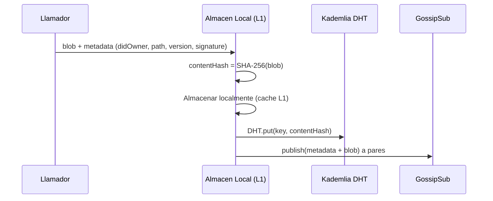
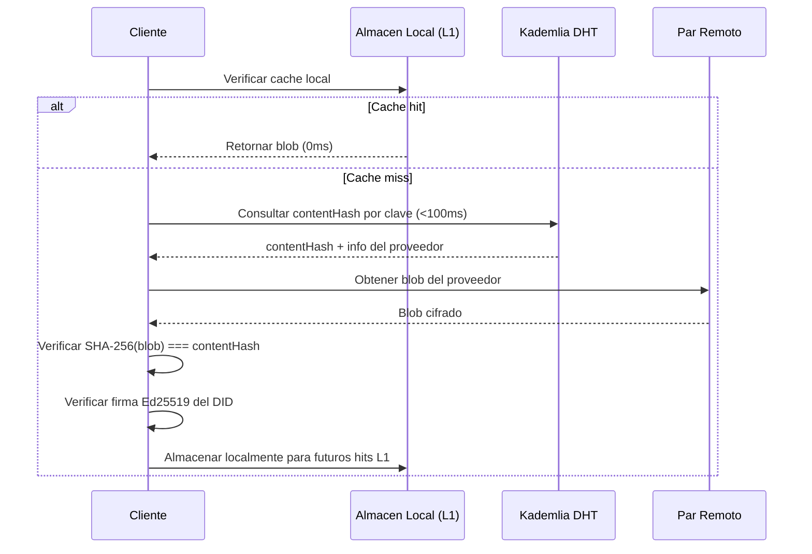
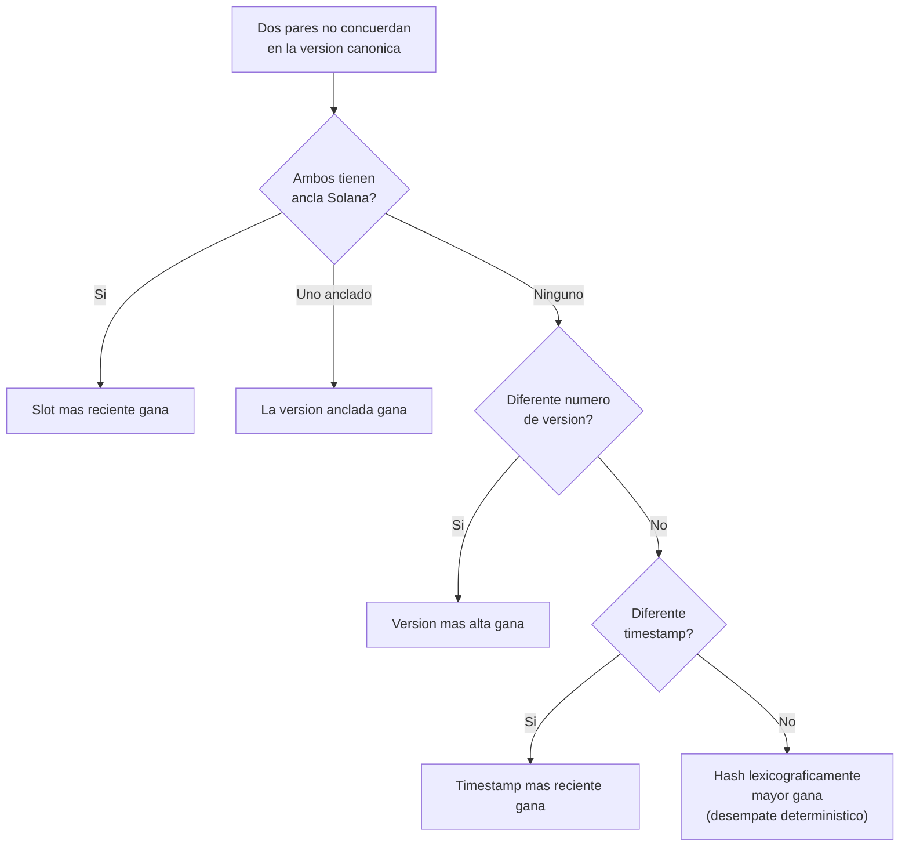

[English](../../TECHNICAL.md) | **[Espanol](./TECHNICAL.es.md)**

---

# Referencia Tecnica

> Este documento es para desarrolladores, ingenieros de protocolo y auditores de seguridad. Para una vista ejecutiva, ver el [README](./README.es.md).

---

## Arquitectura

### Capa de Red (libp2p)

El mesh corre sobre [libp2p](https://libp2p.io/), el stack de red modular usado por IPFS, Filecoin y la capa de consenso de Ethereum.

| Componente | Implementacion | Proposito |
|:-----------|:---------------|:----------|
| Transporte | TCP (primario), WebRTC (planeado) | Conexiones entre pares |
| Cifrado | Protocolo Noise | Todas las conexiones cifradas a nivel de transporte |
| Multiplexacion | Yamux | Multiples streams sobre una sola conexion |
| Descubrimiento | Kademlia DHT + Bootstrap | Encontrar pares por proximidad (distancia XOR) |
| Propagacion | GossipSub | Broadcast epidemico de items nuevos a pares suscritos |
| Identidad | PeerId Ed25519 | Cada nodo tiene una identidad criptografica unica |

**Topic de Gossip:** `/attestto/mesh/1.0.0`

Todos los items del mesh se propagan via GossipSub en un solo topic. Los nodos validan items entrantes antes de almacenarlos (verificacion de hash, verificacion de firma, comparacion de version).

### Capa de Almacenamiento (SQLite + Archivos Planos)

Cada nodo mantiene un almacen local separado de la boveda privada del usuario:

```
{dataDir}/
├── index.db           ← SQLite (modo WAL) — indice de metadatos
└── store/
    ├── {hash}.enc     ← Archivos de blobs cifrados
    └── ...
```

**Schema SQLite:**

```sql
CREATE TABLE items (
  content_hash      TEXT PRIMARY KEY,    -- SHA-256 del blob cifrado
  did_owner         TEXT NOT NULL,       -- DID del dueno de los datos
  path              TEXT NOT NULL,       -- Ruta logica (ej. credentials/examen)
  version           INTEGER NOT NULL,    -- Monotonicamente creciente
  ttl_seconds       INTEGER NOT NULL,    -- 0 = permanente
  created_at        INTEGER NOT NULL,    -- Unix ms
  last_accessed_at  INTEGER NOT NULL,    -- Unix ms (para LRU)
  size_bytes        INTEGER NOT NULL,    -- Tamano del blob
  signature         TEXT NOT NULL,       -- Firma Ed25519 del dueno del DID
  solana_tx_hash    TEXT,                -- Ancla Solana (nullable)
  solana_slot       INTEGER,
  solana_timestamp  INTEGER
);
```

**Indices:** `did_owner`, `(did_owner, path)`, `(ttl_seconds, created_at)`, `last_accessed_at`, `(did_owner, path, version)`

### Capa de Protocolo

#### Flujo PUT



#### Flujo GET



#### Regla de Aceptacion de Versiones

Una nueva version se acepta solo si:
- `nuevaVersion > versionActual` (monotonicamente creciente)
- La firma es valida para el DID reclamado
- El hash del contenido coincide con el blob

### Resolucion de Conflictos

Cuando dos pares no estan de acuerdo sobre la version canonica, los conflictos se resuelven deterministicamente:



Una version anclada siempre gana sobre una sin anclar. Esto incentiva anclar cambios de estado criticos.

### Recoleccion de Basura

GC de tres fases se ejecuta cada 6 horas (configurable):

**Fase 1 — Expiracion TTL:**
Items con `ttl_seconds > 0` donde `created_at + ttl_seconds * 1000 < ahora` se eliminan.

**Fase 2 — Poda de Versiones:**
Para cada `(didOwner, path)` con mas de 2 versiones, solo se mantienen la ultima (canonica) y la penultima (rollback). Todas las versiones anteriores se eliminan.

**Fase 3 — Eviccion LRU (activada por presion):**
Se activa solo cuando el uso de almacenamiento excede 90%. Desaloja los items menos recientemente accedidos hasta que el uso baje del 80%.

**Riel de Seguridad:** Los items nunca se desalojan si menos de 6 pares tienen una copia (consultado via DHT `findProviders`). Esto previene perdida de datos para items sub-replicados.

---

## Referencia de API

### MeshNode

```typescript
import { MeshNode } from '@attestto/mesh'

const node = new MeshNode({
  dataDir: '/ruta/a/mesh',              // Requerido
  bootstrapPeers: [multiaddr, ...],     // Direcciones de pares bootstrap
  listenPort: 4001,                     // Puerto TCP (0 = aleatorio)
  maxStorageBytes: 250 * 1024 * 1024,   // 250 MB por defecto
  gcIntervalMs: 6 * 60 * 60 * 1000,    // 6 horas por defecto
  minHoldersForEviction: 6,             // Riel de seguridad
  maxItemSizeBytes: 10 * 1024,          // 10 KB max por item
})

await node.start()           // Arrancar nodo libp2p
await node.stop()            // Apagado graceful
node.getStatus()             // { peerId, peerCount, dhtReady, uptimeMs, storage, level }
node.getMultiaddrs()         // Direcciones de escucha
node.isRunning               // boolean
node.peerId                  // string

// Eventos (via EventEmitter)
node.on('mesh:event', (event: MeshEvent) => { ... })
node.on('gossip:message', (msg: GossipMessage) => { ... })
```

### MeshStore

```typescript
import { MeshStore } from '@attestto/mesh'

const store = new MeshStore(dataDir, maxStorageBytes?)

store.put(metadata, blob)                    // → boolean
store.get(contentHash)                       // → { metadata, blob } | null
store.has(contentHash)                       // → boolean
store.delete(contentHash)                    // → boolean
store.list({ didOwner?, path?, expiredOnly?, maxVersion?, limit?, orderByAccess? })
store.getLatestByKey(didOwner, path)          // → { metadata, blob } | null
store.getVersions(didOwner, path)             // → MeshItemMetadata[]
store.deleteByDid(didOwner)                   // → number (items eliminados)
store.getUsage()                              // → StorageMetrics
store.close()                                 // Cerrar conexion SQLite
```

### MeshProtocol

```typescript
import { MeshProtocol } from '@attestto/mesh'

const protocol = new MeshProtocol(node, store)

await protocol.put(metadata, blob)           // → contentHash (string)
await protocol.get(didOwner, path)           // → MeshItem | null
await protocol.tombstone(didOwner, signature) // Revocar todos los datos de un DID
```

### MeshGC

```typescript
import { MeshGC } from '@attestto/mesh'

const gc = new MeshGC(store, node, minHolders?)

gc.start(intervalMs)    // Iniciar GC programado
gc.stop()               // Detener programador
await gc.run()           // Ciclo de GC manual → GCResult
```

### Resolucion de Conflictos

```typescript
import { resolveConflict } from '@attestto/mesh'

const result = resolveConflict(candidatoA, candidatoB)
// → { winner, loser, reason: 'anchor' | 'timestamp' | 'hash' }
```

### Utilidades Criptograficas

```typescript
import { hashBlob, verifySignature, signData } from '@attestto/mesh'

hashBlob(data: Uint8Array)                          // → string hex (SHA-256)
await verifySignature(data, signature, publicKey)   // → boolean
await signData(data, privateKey)                    // → firma hex
```

---

## Tipos

Todos los tipos se exportan desde `@attestto/mesh`:

```typescript
// Datos core
MeshItem, MeshItemMetadata, MeshKey, SolanaAnchor

// Configuracion
MeshNodeConfig, DEFAULT_CONFIG

// Estado
MeshNodeStatus, StorageMetrics, NodeLevel

// Eventos
MeshEvent  // Union: peer:connected, peer:disconnected, item:received,
           //        item:stored, item:evicted, storage:pressure,
           //        gc:completed, conflict:resolved

// Gossip
GossipMessage, GossipPutMessage, GossipTombstoneMessage

// Conflicto
ConflictCandidate
```

---

## Modelo de Seguridad

### Principio del Cartero Ciego

Los nodos almacenan blobs cifrados direccionados por hash de contenido. Un nodo:
- **No puede** leer los datos que almacena (cifrados con la llave del dueno)
- **No puede** determinar a quien pertenecen los datos (el campo DID es el identificador publico, no PII)
- **Puede** verificar que un blob coincide con su hash declarado (verificacion de integridad)
- **Puede** verificar que una firma fue producida por el DID reclamado (verificacion de autenticidad)

### Mitigaciones de Amenazas

| Amenaza | Mitigacion |
|:--------|:-----------|
| Ataque Sybil (nodos falsos) | Cada nodo debe presentar un DID vinculado a una identidad nacional verificada |
| Manipulacion de datos | Almacenamiento direccionado por contenido — el hash SHA-256 debe coincidir |
| Ataques de replay | Numeros de version monotonicamente crecientes; nueva version debe estar firmada |
| Escrituras no autorizadas | Firma Ed25519 requerida del dueno del DID |
| Agotamiento de almacenamiento | 10 KB max por item, 250 MB por nodo, eviccion LRU con rieles de seguridad |
| Particion de red | El mesh local sigue operando; ancla Solana resuelve conflictos al reconectarse |

### Lo que Esta Libreria NO Hace

- Gestion de llaves (usar una boveda como SQLCipher)
- Resolucion de DIDs (se integrara con el resolver `did:sns`)
- Cifrado de blobs (el llamador debe cifrar antes de `put()`)
- Autenticacion de pares (planeado via autenticacion basada en DID)

---

## Compilar y Probar

```bash
# Instalar
pnpm install

# Verificar tipos (modo estricto)
pnpm type-check

# Ejecutar todos los tests
pnpm test

# Compilar (salida dual ESM + CJS)
pnpm build

# Modo watch
pnpm dev           # tsup --watch
pnpm test:watch    # vitest
```

### Cobertura de Tests

| Suite | Tests | Que cubre |
|:------|------:|:----------|
| `store.test.ts` | 18 | CRUD, limites de tamano, versionamiento, eliminacion tombstone, metricas, ancla Solana |
| `conflict.test.ts` | 6 | Prioridad de ancla, orden de version, timestamp, desempate deterministico, simetria |
| `crypto.test.ts` | 6 | Consistencia SHA-256, firma/verificacion Ed25519, deteccion de manipulacion, rechazo de llave incorrecta |

---

## Contribuir

Esto es Infraestructura Digital Publica. Las contribuciones son bienvenidas.

1. Haz fork del repositorio
2. Crea una rama de feature
3. Escribe tests para la nueva funcionalidad
4. Asegurate de que `pnpm test` y `pnpm type-check` pasen
5. Abre un pull request

Ver la [Licencia Apache 2.0](../../LICENSE) para los terminos.
